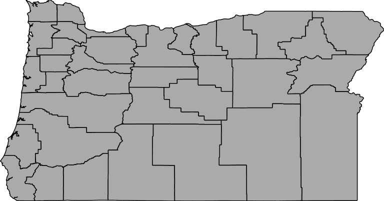

# Meteorology-Basemap Design
The base map is stylized from the mapbox Odyssey style. The dark backgound is used to drak attention away from the details in the urban areas and highlight the GPS stations used for meterological purposes. by the aim of using the dark map one can add the meterological thematic data with more focus on the base map to concebtrate on the thematic natural features and hazards using shares of lighter colors.
By using dark colors and a dark background encourges the map and its focus on the processing stations to be taken seriously. Areas of industry and grean area are displayed in a lighter tone in the higher zooming scale to distinguih the urban areas. Becasue these are small areas they do not force the areas to be as prevalent on the map.
Therefore, The highlited features in the first galance in this base map should be the distribution of the GPS stations and their closeness to the coast line. That is the reason for adding the stations location as a new layer (.kml) to the basemap.
The colors are selected by the color pallete #3566 ( http://colorpalettes.net/) so that the consistancy between level of colors  can be seen in the basemap.The changes of the fonts and colors have been used for different level of zomming scale to make visible more deteils when it needs based on the zoom scale. In order to use symbols (.svg) for some of the layers such as airports, stations and etc, the MAKI icon editor has been used.

### WFS URL

   http://localhost:8080/geoserver/ceoas/ows?service=WFS&version=1.0.0&request=GetFeature&typeName=ceoas:ore_counties&maxFeatures=50&outputFormat=application%2Fjson

### WMS URL

   http://localhost:8080/geoserver/ceoas/wms?service=WMS&version=1.1.0&request=GetMap&layers=ceoas:ore_counties&styles=&bbox=-124.56670504390223,41.991794810535794,-116.46326242572455,46.23731681568611&width=768&height=402&srs=EPSG:4326&format=image%2Fpng

